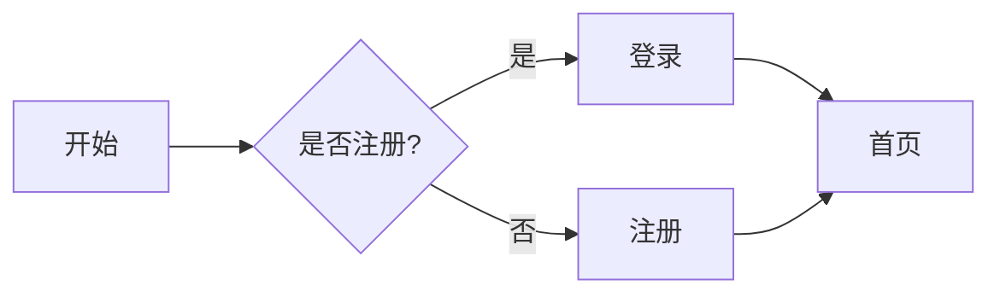






这是一篇"展示型"文章，会尽可能地把本站支持的 **Markdown 语法**、**宏组件**、**图片画廊**、**按钮** 等都演示一遍，方便你写自己的内容时直接参考 (´▽`)

## 1. 标题层级

# H1 标题
## H2 标题
### H3 标题
#### H4 标题
##### H5 标题

## 2. 文字强调

普通文本，**加粗**，*斜体*，***加粗 + 斜体***，~~删除线~~，`行内代码`。

> 这是一段引用文字，用于强调、备注或引用他人的话。
>
> 引用可以多行。

## 3. 列表

### 无序列表

- 一年级
- 二年级
- 三年级
  - 三年级一班
  - 三年级二班

### 有序列表

1. 第一步
2. 第二步
3. 第三步

### 任务列表

- [x] 已完成
- [ ] 待办事项 1
- [ ] 待办事项 2

## 4. 链接

- 内联链接：[返回首页]({{ "/" | url }})
- 带标题的链接：[Wiki 首页]({{ "/wiki/" | url }} "Wiki 文档")
- 自动链接：<https://github.com>

## 5. 图片 & 图片画廊

单张图片演示：


> 上面的 `image` 短代码会被处理为响应式 `<picture>`，自动生成 WebP + JPEG 多分辨率。
> 但普通 Markdown 图片不会被处理，仅作示意。

下面是 **image 画廊**（用项目内置的 shortcode）：

<div class="image-gallery">
    
    
    
</div>

## 6. 代码块

### JavaScript

```javascript
// 求斐波那契数列第 n 项
function fib(n) {
    if (n <= 1) return n;
    return fib(n - 1) + fib(n - 2);
}

console.log(fib(10)); // 55
```

### Python

```python
def greet(name: str) -> str:
    return f"Hello, {name}!"

print(greet("World"))
```

### HTML

```html
<!DOCTYPE html>
<html lang="zh-CN">
<head>
    <meta charset="UTF-8">
    <title>示例</title>
</head>
<body>
    <h1>Hello</h1>
</body>
</html>
```

### Shell / PowerShell

```powershell
npm install
npm run dev
```

## 7. 表格

| 字段       | 类型    | 必填 | 说明             |
| ---------- | ------- | ---- | ---------------- |
| `title`    | string  | 是   | 文章标题         |
| `author`   | string  | 否   | 作者姓名         |
| `date`     | date    | 否   | 发布日期         |
| `tags`     | array   | 否   | 标签数组         |
| `layout`   | string  | 否   | 布局模板路径     |

## 8. 分隔线

---

## 9. 折叠 / 详情

<details>
<summary>点击展开：什么是 Eleventy？</summary>

Eleventy（简称 11ty）是一个简洁强大的静态站点生成器，基于 Node.js。
本仓库就是用 Eleventy 构建的。

- 官网：<https://www.11ty.dev>
- 优点：配置简单、速度快、支持多种模板语言
</details>

## 10. 脚注

这是一段包含脚注的文字[^1]，还有另一个脚注[^note]。

[^1]: 这是第一个脚注的内容。
[^note]: 这是带自定义名字的脚注。

## 11. 转义字符

如果要显示 Markdown 的特殊字符，可以使用反斜杠转义：\* 不是斜体 \*，\# 不是标题。

---

## 12. 宏组件演示

### 12.1 按钮（button.njk）

普通按钮：

{{ button("fa-solid fa-play", "立即开始", "/") }}
{{ button("fa-solid fa-book", "阅读 Wiki", "/wiki/") }}
{{ button("fa-solid fa-code", "查看源码", "https://github.com") }}

### 12.1.1 自定义颜色

按钮宏支持 `btnColor` / `textColor` / `btnHover` 三个可选参数，未传的字段继续走默认主题色。

仅自定义背景色（与 `index.md` 中"了解更多"按钮一致）：

<div>
{{ button("fa-solid fa-arrow-right", "了解更多", "/about/", btnColor="rgba(200, 255, 200)") }}
</div>

自定义背景色 + 文字色：

<div>
{{ button("fa-solid fa-palette", "主题色按钮", "#", btnColor="#222831", textColor="#ffd369") }}
</div>

自定义背景色 + hover 背景色：

<div>
{{ button("fa-solid fa-hand-pointer", "试试 hover", "#", btnColor="#74c0fc", btnHover="#1c7ed6") }}
</div>

背景色 / 文字色 / hover 全部自定义：

<div>
{{ button("fa-solid fa-wand-magic-sparkles", "全部自定义", "#", btnColor="#ff6b6b", textColor="#fff5f5", btnHover="#c92a2a") }}
</div>

### 12.1.2 自定义边框颜色

`btnBorder` 自定义边框颜色，`btnBorderHover` 自定义 hover 时的边框颜色；未传则继续走 `--border-color-blue`，与三套主题联动。

仅自定义边框：

<div>
{{ button("fa-solid fa-circle", "红框按钮", "#", btnBorder="#e03131") }}
</div>

自定义边框 + 边框 hover（hover 时边框变深红）：

<div>
{{ button("fa-solid fa-circle-arrow-right", "红框 hover", "#", btnBorder="#e03131", btnBorderHover="#c92a2a") }}
</div>

背景与边框一起配：

<div>
{{ button("fa-solid fa-pen", "编辑", "#", btnColor="#fff0f0", btnBorder="#e03131") }}
</div>

背景 + 文字 + hover + 边框 + 边框 hover 五参全开：

<div>
{{ button("fa-solid fa-crown", "全部自定义", "#", btnColor="#e03131", textColor="#fff5f5", btnHover="#c92a2a", btnBorder="#ffd369", btnBorderHover="#fab005") }}
</div>

### 12.2 卡片（card.njk）

#### 12.2.1 `cardFull` 通栏独立卡片

{{ cardFull(
    "6月班级量化分",
    "本次量化分由纪律、学习、卫生三项组成，详情见正文。",
    "#",
    "查看详细信息"
) }}

{{ cardFull(
    "Wiki 文档",
    "新手指南、编码规范、写作规范一应俱全。",
    "/wiki/",
    "浏览 Wiki"
) }}

#### 12.2.2 `card` 网格卡片

{{ card("事件", "查看所有事件", "/event/") }}
{{ card("文章", "查看所有文章", "/article/") }}
{{ card("Wiki", "项目文档与教程", "/wiki/") }}

上面是没有套div，所以不是三列展示

<div class="cardzone-three-columns">
{{ card("学习资源", "一些常用的学习资源", "/zone/study/", " 跳转") }}
{{ card("事件", "班级里的一些事件", "/event/", "进入") }}
{{ card("讨论区", "[需要 Github 账户]可以在这里讨论一些事情", "/discussion/", "前往") }}
</div>

套了div后

#### 12.2.3 `cardStandalone` 独立信息卡片

{{ cardStandalone("fa-solid fa-circle-info", "提示", "这是一条提示信息卡片。") }}

{{ cardStandalone("fa-solid fa-triangle-exclamation", "警告", "这是一条警告信息卡片。", bgColor="#fffbe6", textColor="#5a4a00") }}

{{ cardStandalone("fa-solid fa-circle-check", "成功", "这是一条成功信息卡片。", bgColor="#e7f8ee", textColor="#1a6e3a") }}

#### 12.2.4 `cardStandalone` 三列网格版

通过传入 `grid=true` 参数（等价于在卡片元素上叠加 `.card-standalone-grid` 类），`cardStandalone` 即可在 `.cardzone-three-columns` 容器中以三列布局展示，最大宽度限制被取消，卡片会填满网格单元。

<div class="cardzone-three-columns">
{{ cardStandalone("fa-solid fa-handshake", "开放共享", "班级资料、学习笔记默认对所有人可见。", grid=true) }}
{{ cardStandalone("fa-solid fa-language", "中文优先", "文档以中文为主要维护语言,再翻译为英文。", grid=true) }}
{{ cardStandalone("fa-solid fa-flask", "动手实践", "在真实项目中学习 Web 开发,不做「只看不写」。", grid=true) }}
{{ cardStandalone("fa-solid fa-shield-halved", "友好社区", "遵守行为准则,营造尊重、包容的讨论氛围。", grid=true) }}
</div>

#### 12.2.5 card 自定义颜色

卡片宏支持 `bgColor` / `textColor` / `borderColor` / `hoverBgColor` / `hoverBorderColor` 等参数自定义卡片样式，同时也支持按钮相关的颜色参数（`btnColor` / `btnTextColor` / `btnHover` / `btnBorder` / `btnBorderHover`）。未传的字段继续走默认主题色。

自定义背景色 + 文字色 + 边框色（暖色调）：

<div class="cardzone-three-columns">
{{ card("暖色调卡片", "自定义背景、文字和边框颜色", "#", "了解更多", bgColor="#fff5f5", textColor="#c92a2a", borderColor="#ff8787") }}
{{ card("冷色调卡片", "清爽的蓝色系配色", "#", "了解更多", bgColor="#e7f5ff", textColor="#1864ab", borderColor="#74c0fc") }}
{{ card("绿色系卡片", "清新自然的绿色调", "#", "了解更多", bgColor="#ebfbee", textColor="#2b8a3e", borderColor="#8ce99a") }}
</div>

自定义 hover 背景色和 hover 边框色：

<div class="cardzone-three-columns">
{{ card("hover 变色", "鼠标悬停查看效果", "#", "悬停试试", hoverBgColor="#fff0f6", hoverBorderColor="#f06595") }}
{{ card("深色 hover", "悬停时背景变深", "#", "悬停试试", hoverBgColor="#212529", textColor="#adb5bd", hoverBorderColor="#495057") }}
{{ card("金色边框", "hover 时边框变金色", "#", "悬停试试", borderColor="#dee2e6", hoverBorderColor="#fab005") }}
</div>

自定义按钮颜色的卡片：

<div class="cardzone-three-columns">
{{ card("红色按钮", "按钮颜色自定义", "#", "红色按钮", btnColor="#fff5f5", btnTextColor="#c92a2a", btnHover="#ffc9c9", btnBorder="#ff8787") }}
{{ card("深色按钮", "暗色风格按钮", "#", "深色按钮", btnColor="#212529", btnTextColor="#ffd43b", btnHover="#343a40", btnBorder="#495057") }}
{{ card("渐变风格", "绿色系按钮搭配", "#", "绿色按钮", btnColor="#2b8a3e", btnTextColor="#ebfbee", btnHover="#1c532b", btnBorder="#8ce99a", btnBorderHover="#2b8a3e") }}
</div>

#### 12.2.5 cardFull 自定义颜色

通栏卡片同样支持完整的颜色自定义，下面是一个全套自定义的示例：

{{ cardFull(
    "全站自定义主题卡片",
    "这张卡片演示了 cardFull 宏的完整颜色自定义能力：背景色、文字色、边框色、hover 效果，以及按钮的背景、文字、边框、hover 颜色全部自定义。将鼠标悬停在卡片和按钮上试试看吧～",
    "#",
    "试试看",
    bgColor="#fff9db",
    textColor="#5c3d00",
    borderColor="#ffd43b",
    hoverBgColor="#fff3bf",
    hoverBorderColor="#fab005",
    btnColor="#f08c00",
    btnTextColor="#fff9db",
    btnHover="#e67700",
    btnBorder="#ffd43b",
    btnBorderHover="#fab005"
) }}

> **说明**：hover 效果包括卡片整体的背景色变化和边框色变化，按钮也有独立的 hover 效果。所有颜色参数都是可选的，未传入的字段会自动使用主题默认值。

### 12.3 header 自定义背景色

header 导航栏支持两种方式自定义背景颜色，颜色会通过 `--header-bg` CSS 变量设置在 `<header>` 元素上。未设置时使用主题色（`--color-primary`）。

**优先级（从高到低）**：
1. **njk 模板 set 标签** —— 在 layout 里通过 `set headerBg = "..."` 后 include header。因为 Nunjucks set 是在 include 之前求值，会**覆盖**下方 front matter 的设置
2. **markdown front matter** —— `headerBg: "#xxx"`（次高优先级）
3. **主题色兜底** —— 未设置时使用 `--color-primary`（跟随深浅色主题）

#### 方式 1：在 markdown 的 front matter 中定义

在 markdown 文件的 front matter 里写：


```
---
title: 我的页面
headerBg: "#c92a2a"
---
```


这样这个页面的导航栏背景就会变成红色。

#### 方式 2：在 njk 模板中定义（在 layout 中）—— 优先级最高

在 layout 模板中通过 Nunjucks 的 set 标签设置 `headerBg` 变量，再 include 引入 header 组件：


```


```


> 该 set 会**覆盖** markdown front matter 中的 `headerBg` 设置。适用于「整批页面统一换 header 底色但不想改每个 md」的场景。

#### 实现原理

- `src/style/header.scss`：把硬编码的 `$color-primary` 改为 `var(--header-bg, $color-primary)`
- `src/_includes/components/header.njk`：根据 `headerBg` 变量是否为空，条件性地渲染 `style` 属性

#### 自定义按钮 hover / 移动端背景（全局）

按钮 hover 与移动端展示的 5 处背景色**不暴露页面级字段**，统一在全局主题文件 `_theme-vars.scss` 中以 CSS 变量集中配置：

| 变量 | 作用 | 默认值 |
|---|---|---|
| `--header-hover-bg` | 桌面端导航按钮 hover 背景 | `color-mix(in srgb, var(--header-bg, var(--color-primary)) 15%, transparent)` |
| `--nav-drawer-close-hover-bg` | 移动端关闭按钮 hover 背景 | 同上 |
| `--nav-mobile-btn-bg` | 移动端菜单默认背景 | `color-mix(in srgb, var(--header-bg, var(--color-primary)) 30%, transparent)` |
| `--nav-mobile-btn-border` | 移动端菜单边框 | `color-mix(in srgb, var(--header-bg, var(--color-primary)) 60%, transparent)` |
| `--nav-mobile-btn-hover-bg` | 移动端菜单 hover 背景 | `color-mix(in srgb, var(--header-bg, var(--color-primary)) 60%, transparent)` |

默认值用 `color-mix` 自动跟随 `--header-bg` 计算：只设置 `headerBg` 时 hover 也会给出协调的对比色。若需统一替换某一处（例如所有页面的移动端菜单都改成黑色半透明），直接在 `_theme-vars.scss` 的浅色 / 深色 `:root` 中改对应变量即可。

**覆盖单个按钮**：无需修改 njk 模板，按 CSS 选择器写更高优先级的规则即可：

```scss
.nav-btns a[href="/article/"]:hover {
    --header-hover-bg: rgba(76, 175, 80, 0.3); // "文章"按钮 hover 显示绿色
}
```

## 13. 数学公式（如启用 KaTeX）

行内公式：爱因斯坦的质能方程 $E = mc^2$。

块级公式：

$$
\int_{-\infty}^{\infty} e^{-x^2} \, dx = \sqrt{\pi}
$$

## 14. Mermaid 流程图（如启用）



## 14.5 模态弹窗（popup.njk）

与导航弹窗（`nav-popup`）不同，**模态弹窗**是内容型弹窗：公告、确认框、富文本说明等。它有独立的遮罩、焦点陷阱、ESC 关闭逻辑，且支持多个弹窗互斥堆叠。

### 14.5.1 基础用法（按钮触发）

只需给任意元素加 `data-modal-open="<id>"` 属性即可触发对应弹窗。

推荐使用 `modalTrigger` 宏（自动绑定 `data-modal-open` 属性，渲染为 `<button type="button">`，避免点击跳转到页面顶部）：

{{ modalTrigger("announcement", "fa-solid fa-circle-info", "查看公告", btnColor="#74c0fc", btnHover="#1c7ed6") }}
{{ modalTrigger("notice", "fa-solid fa-bell", "查看通知") }}

{{ popup(
    "announcement",
    "📢 站点公告",
    "<p>这是一段普通的文字内容。</p><p>模态弹窗支持 <strong>富文本</strong>、<em>斜体</em>、<a href=\"#\">链接</a> 以及嵌套的 <code>macro</code>。</p>",
    size="md",
    icon="fa-solid fa-circle-info"
) }}

{{ popup(
    "notice",
    "🔔 通知",
    "<p>来自 <code>modalTrigger</code> 的第二个示例。</p>",
    size="md",
    icon="fa-solid fa-bell"
) }}

### 14.5.2 三种尺寸

<div>
{{ modalTrigger("size-sm", "fa-solid fa-compress", "小弹窗 (sm)", btnColor="#d3f9d8", btnHover="#b2f2bb") }}
{{ modalTrigger("size-md", "fa-solid fa-expand", "中弹窗 (md)", btnColor="#fff3bf", btnHover="#ffe066") }}
{{ modalTrigger("size-lg", "fa-solid fa-up-right-and-down-left-from-center", "大弹窗 (lg)", btnColor="#ffd8a8", btnHover="#ffa94d") }}
</div>

{{ popup("size-sm", "小尺寸弹窗", "<p>适用于简短通知、确认对话框。</p>", size="sm", icon="fa-solid fa-compress") }}
{{ popup("size-md", "中尺寸弹窗（默认）", "<p>默认尺寸，适用于一般说明、富文本展示。</p>", size="md", icon="fa-solid fa-expand") }}
{{ popup("size-lg", "大尺寸弹窗", "<p>宽度最大，适用于长篇内容、条款说明。</p><p>主体内容超过最大高度时会自动出现滚动条。</p>", size="lg", icon="fa-solid fa-up-right-and-down-left-from-center") }}

### 14.5.3 JS 函数触发

通过 `window.openModal(id)` / `window.closeModal(id)` 可在任何 JS 代码中触发。

使用 `modalTrigger` 渲染两个按钮，分别演示 `action="open"` 与 `action="close"`：

{{ modalTrigger("js-demo", "fa-solid fa-code", "JS 打开弹窗", btnColor="#222831", textColor="#ffd369") }}
{{ modalTrigger("js-demo", "fa-solid fa-xmark", "JS 关闭弹窗", action="close") }}

```html
<button onclick="window.openModal('js-demo')">JS 打开</button>
<button onclick="window.closeModal('js-demo')">JS 关闭</button>
```

{{ popup(
    "js-demo",
    "由 JavaScript 触发",
    "<p>本弹窗由 <code>window.openModal('js-demo')</code> 触发。</p>",
    icon="fa-solid fa-code"
) }}

### 14.5.4 自定义页脚（确认对话框）

通过 `footer` 参数传入按钮组 HTML，典型场景是确认对话框。

{{ modalTrigger("confirm-delete", "fa-solid fa-trash", "删除（带确认）", btnColor="#fff5f5", textColor="#c92a2a", btnBorder="#ff8787", btnHover="#ffc9c9") }}

{{ popup(
    "confirm-delete",
    "确认删除",
    "<p>此操作不可恢复，是否继续？</p>",
    size="sm",
    icon="fa-solid fa-triangle-exclamation",
    footer="<button class='btn-pill' data-modal-close='confirm-delete' style='--btn-bg:#e9ecef; --btn-fg:#495057; --btn-border:transparent;'>取消</button> <button class='btn-pill' onclick='window.closeModal(`confirm-delete`)' style='--btn-bg:#fa5252; --btn-fg:#fff5f5; --btn-border:#c92a2a;'>确认删除</button>"
) }}

### 14.5.5 强制操作（隐藏关闭按钮）

通过 `showClose=false` 隐藏右上角 X，用户**只能点击页脚按钮**继续。常用于必须做出选择、不能跳过的场景。

{{ modalTrigger("must-ack", "fa-solid fa-shield-halved", "强制确认", btnColor="#5f3dc4", textColor="#fff") }}

{{ popup(
    "must-ack",
    "重要提示",
    "<p>你必须点击「我已知晓」才能继续。右上角关闭按钮已隐藏。</p>",
    size="sm",
    icon="fa-solid fa-shield-halved",
    showClose=false,
    footer='<button class="btn-pill" data-modal-close="must-ack">我已知晓</button>'
) }}

### 14.5.6 富文本 / 嵌套宏

弹窗主体支持任意 HTML 与宏组件嵌套（标题、段落、列表、表格、代码块、`button` 宏、`cardStandalone` 宏都可以）。

{{ modalTrigger("rich-content", "fa-solid fa-gift", "查看特性", btnColor="#fa5252", textColor="#fff") }}


<h4>这是一个四级标题</h4>
<p>弹窗主体接受任意 HTML：<strong>加粗</strong>、<em>斜体</em>、<a href="#">链接</a>、行内 <code>code</code> 都可以。</p>
<p>有序列表：</p>
<ol>
    <li>第一项</li>
    <li>第二项</li>
    <li>第三项</li>
</ol>
<p>无序列表：</p>
<ul>
    <li>列表项 A</li>
    <li>列表项 B</li>
</ul>
<p>表格：</p>
<table>
    <thead>
        <tr>
            <th>字段</th>
            <th>类型</th>
            <th>说明</th>
        </tr>
    </thead>
    <tbody>
        <tr>
            <td><code>id</code></td>
            <td>string</td>
            <td>弹窗全局唯一 id</td>
        </tr>
        <tr>
            <td><code>size</code></td>
            <td>"sm" | "md" | "lg"</td>
            <td>弹窗尺寸档位</td>
        </tr>
        <tr>
            <td><code>icon</code></td>
            <td>string</td>
            <td>FA 图标类名</td>
        </tr>
    </tbody>
</table>
<p>代码块：</p>
<pre><code class="language-javascript">// 打开 / 关闭弹窗
window.openModal('hello');
window.closeModal('hello');</code></pre>
<p>嵌套宏（<code>button</code>）：</p>
<p>
    {{ button("fa-solid fa-thumbs-up", "点赞", "#", btnColor="#fab005") }}
    {{ button("fa-solid fa-share", "分享", "#", btnColor="#74c0fc") }}
</p>
<p>嵌套宏（<code>cardStandalone</code>）：</p>
{{ cardStandalone("fa-solid fa-circle-info", "提示", "这是弹窗里嵌套的独立信息卡片。") }}

{{ popup("rich-content", "富文本支持", _body, icon="fa-solid fa-gift", size="lg") }}

### 14.5.7 多弹窗互斥

新弹窗打开时会自动关闭已打开的弹窗（互斥）。

{{ modalTrigger("layer-1", "fa-solid fa-layer-group", "打开第一层") }}
{{ modalTrigger("layer-2", "fa-solid fa-layer-group", "打开第二层") }}

{{ popup("layer-1", "第一层", "<p>点击「打开第二层」可切换。</p>", size="sm") }}
{{ popup("layer-2", "第二层", "<p>第二个弹窗。打开时会自动关闭第一个。</p>", size="sm") }}

---

## 15. 结束语

以上就是本站几乎所有的可展示元素，希望对你有帮助～ (•̀ᴗ•)و

如需补充其它语法或宏，编辑本文件即可。