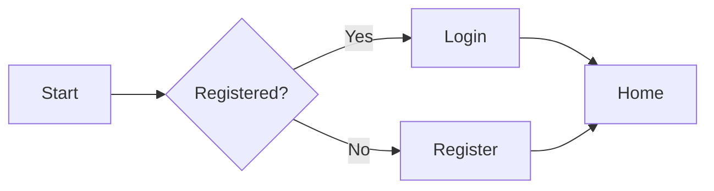






This is a "showcase" article that demonstrates as much of the site's supported **Markdown syntax**, **macros**, **image galleries**, **buttons** and so on as possible, so you can reference it directly when writing your own content (´▽`)

## 1. Heading Levels

# H1 Heading
## H2 Heading
### H3 Heading
#### H4 Heading
##### H5 Heading

## 2. Text Emphasis

Regular text, **bold**, *italic*, ***bold + italic***, ~~strikethrough~~, `inline code`.

> This is a blockquote, used to emphasize, note, or quote someone else's words.
>
> A blockquote can span multiple lines.

## 3. Lists

### Unordered List

- Grade One
- Grade Two
- Grade Three
  - Class 3-1
  - Class 3-2

### Ordered List

1. Step one
2. Step two
3. Step three

### Task List

- [x] Completed
- [ ] Todo 1
- [ ] Todo 2

## 4. Links

- Inline link: [Back to Home]({{ "/" | url }})
- Link with title: [Wiki Home]({{ "/wiki/" | url }} "Wiki Docs")
- Autolink: <https://github.com>

## 5. Images and Image Gallery

Single-image demo:


> The `image` shortcode above is processed into a responsive `<picture>` with auto-generated WebP + JPEG at multiple resolutions.
> Plain Markdown images are NOT processed — these are just for illustration.

Below is the **image gallery** (using the built-in shortcode):

<div class="image-gallery">
    
    
    
</div>

## 6. Code Blocks

### JavaScript

```javascript
// Compute the nth Fibonacci number
function fib(n) {
    if (n <= 1) return n;
    return fib(n - 1) + fib(n - 2);
}

console.log(fib(10)); // 55
```

### Python

```python
def greet(name: str) -> str:
    return f"Hello, {name}!"

print(greet("World"))
```

### HTML

```html
<!DOCTYPE html>
<html lang="en">
<head>
    <meta charset="UTF-8">
    <title>Example</title>
</head>
<body>
    <h1>Hello</h1>
</body>
</html>
```

### Shell / PowerShell

```powershell
npm install
npm run dev
```

## 7. Tables

| Field      | Type    | Required | Description                |
| ---------- | ------- | -------- | -------------------------- |
| `title`    | string  | yes      | Article title              |
| `author`   | string  | no       | Author name                |
| `date`     | date    | no       | Publication date           |
| `tags`     | array   | no       | Tag array                  |
| `layout`   | string  | no       | Layout template path       |

## 8. Horizontal Rule

---

## 9. Collapse / Details

<details>
<summary>Click to expand: What is Eleventy?</summary>

Eleventy (11ty for short) is a simple yet powerful static site generator built on Node.js.
This very repo is built with Eleventy.

- Official site: <https://www.11ty.dev>
- Strengths: simple config, fast, supports multiple template languages
</details>

## 10. Footnotes

Here's some text with a footnote[^1], and another footnote[^note].

[^1]: This is the content of the first footnote.
[^note]: This is a footnote with a custom name.

## 11. Escape Characters

To display Markdown special characters, use a backslash to escape them: \* is not italic \*, \# is not a heading.

---

## 12. Macro Component Demo

### 12.1 Button (button.njk)

Regular buttons:

{{ button("fa-solid fa-play", "Get Started", "/") }}
{{ button("fa-solid fa-book", "Read the Wiki", "/wiki/") }}
{{ button("fa-solid fa-code", "View Source", "https://github.com") }}

### 12.1.1 Custom Colors

The button macro accepts three optional parameters — `btnColor` / `textColor` / `btnHover`. Any field you omit falls back to the default theme color.

Custom background only (matches the "Learn More" button in `index.md`):

<div>
{{ button("fa-solid fa-arrow-right", "Learn More", "/about/", btnColor="rgba(200, 255, 200)") }}
</div>

Custom background + text color:

<div>
{{ button("fa-solid fa-palette", "Themed Button", "#", btnColor="#222831", textColor="#ffd369") }}
</div>

Custom background + hover background:

<div>
{{ button("fa-solid fa-hand-pointer", "Try Hover", "#", btnColor="#74c0fc", btnHover="#1c7ed6") }}
</div>

Background / text / hover all customized:

<div>
{{ button("fa-solid fa-wand-magic-sparkles", "All Custom", "#", btnColor="#ff6b6b", textColor="#fff5f5", btnHover="#c92a2a") }}
</div>

### 12.1.2 Custom Border Color

`btnBorder` customizes the border color, `btnBorderHover` customizes the hover border color. When omitted, they fall back to `--border-color-blue`, tied to the three themes.

Border only:

<div>
{{ button("fa-solid fa-circle", "Red Border", "#", btnBorder="#e03131") }}
</div>

Border + border hover (border turns dark red on hover):

<div>
{{ button("fa-solid fa-circle-arrow-right", "Red Border Hover", "#", btnBorder="#e03131", btnBorderHover="#c92a2a") }}
</div>

Background paired with border:

<div>
{{ button("fa-solid fa-pen", "Edit", "#", btnColor="#fff0f0", btnBorder="#e03131") }}
</div>

Background + text + hover + border + border hover — all five parameters:

<div>
{{ button("fa-solid fa-crown", "All Custom", "#", btnColor="#e03131", textColor="#fff5f5", btnHover="#c92a2a", btnBorder="#ffd369", btnBorderHover="#fab005") }}
</div>

### 12.2 Card (card.njk)

#### 12.2.1 `cardFull` Full-Width Standalone Card

{{ cardFull(
    "June Class Score",
    "This month's score consists of discipline, study and hygiene — see the article for details.",
    "#",
    "View Details"
) }}

{{ cardFull(
    "Wiki Docs",
    "Beginner guide, coding standards, writing guidelines — all in one place.",
    "/wiki/",
    "Browse Wiki"
) }}

#### 12.2.2 `card` Grid Card

{{ card("Events", "View all events", "/event/") }}
{{ card("Articles", "View all articles", "/article/") }}
{{ card("Wiki", "Project docs and tutorials", "/wiki/") }}

Without a wrapping div, these don't render in three columns.

<div class="cardzone-three-columns">
{{ card("Study Resources", "Some commonly used study resources", "/zone/study/", "Go") }}
{{ card("Events", "Some class events", "/event/", "Enter") }}
{{ card("Discussion", "[GitHub account required] Discuss things here", "/discussion/", "Visit") }}
</div>

After wrapping in a div.

#### 12.2.3 `cardStandalone` Standalone Info Card

{{ cardStandalone("fa-solid fa-circle-info", "Tip", "This is an info card.") }}

{{ cardStandalone("fa-solid fa-triangle-exclamation", "Warning", "This is a warning info card.", bgColor="#fffbe6", textColor="#5a4a00") }}

{{ cardStandalone("fa-solid fa-circle-check", "Success", "This is a success info card.", bgColor="#e7f8ee", textColor="#1a6e3a") }}

#### 12.2.4 `cardStandalone` Three-Column Grid

By passing `grid=true` (equivalent to adding the `.card-standalone-grid` class), `cardStandalone` can be displayed in three columns inside a `.cardzone-three-columns` container. The max-width is removed and cards fill the grid cell.

<div class="cardzone-three-columns">
{{ cardStandalone("fa-solid fa-handshake", "Open and Shared", "Class materials and notes are visible to everyone by default.", grid=true) }}
{{ cardStandalone("fa-solid fa-language", "Chinese First", "Docs are maintained primarily in Chinese, then translated to English.", grid=true) }}
{{ cardStandalone("fa-solid fa-flask", "Hands-On", "Learn web dev by building real projects — no 'read-only' allowed.", grid=true) }}
{{ cardStandalone("fa-solid fa-shield-halved", "Friendly Community", "Follow the code of conduct for a respectful, inclusive discussion.", grid=true) }}
</div>

#### 12.2.5 card Custom Colors

The card macro supports `bgColor` / `textColor` / `borderColor` / `hoverBgColor` / `hoverBorderColor` parameters for custom styling, plus the button-related color parameters (`btnColor` / `btnTextColor` / `btnHover` / `btnBorder` / `btnBorderHover`). Any field you omit falls back to the default theme color.

Custom background + text + border (warm tone):

<div class="cardzone-three-columns">
{{ card("Warm Tone Card", "Custom background, text and border colors", "#", "Learn More", bgColor="#fff5f5", textColor="#c92a2a", borderColor="#ff8787") }}
{{ card("Cool Tone Card", "A clean blue palette", "#", "Learn More", bgColor="#e7f5ff", textColor="#1864ab", borderColor="#74c0fc") }}
{{ card("Green Tone Card", "Fresh, natural green tones", "#", "Learn More", bgColor="#ebfbee", textColor="#2b8a3e", borderColor="#8ce99a") }}
</div>

Custom hover background and hover border colors:

<div class="cardzone-three-columns">
{{ card("Hover Color Change", "Hover to see the effect", "#", "Try Hover", hoverBgColor="#fff0f6", hoverBorderColor="#f06595") }}
{{ card("Dark Hover", "Background darkens on hover", "#", "Try Hover", hoverBgColor="#212529", textColor="#adb5bd", hoverBorderColor="#495057") }}
{{ card("Gold Border", "Border turns gold on hover", "#", "Try Hover", borderColor="#dee2e6", hoverBorderColor="#fab005") }}
</div>

Card with custom button colors:

<div class="cardzone-three-columns">
{{ card("Red Button", "Custom button color", "#", "Red Button", btnColor="#fff5f5", btnTextColor="#c92a2a", btnHover="#ffc9c9", btnBorder="#ff8787") }}
{{ card("Dark Button", "Dark style button", "#", "Dark Button", btnColor="#212529", btnTextColor="#ffd43b", btnHover="#343a40", btnBorder="#495057") }}
{{ card("Gradient Style", "Green button pairing", "#", "Green Button", btnColor="#2b8a3e", btnTextColor="#ebfbee", btnHover="#1c532b", btnBorder="#8ce99a", btnBorderHover="#2b8a3e") }}
</div>

#### 12.2.6 cardFull Custom Colors

Full-width cards support the same complete color customization. Here's a fully customized example:

{{ cardFull(
    "Site-Wide Custom Theme Card",
    "This card demonstrates the full color customization of the cardFull macro: background, text, border, hover effects, and the button's background, text, border and hover colors are all customized. Hover over the card and the button to try it out~",
    "#",
    "Try It",
    bgColor="#fff9db",
    textColor="#5c3d00",
    borderColor="#ffd43b",
    hoverBgColor="#fff3bf",
    hoverBorderColor="#fab005",
    btnColor="#f08c00",
    btnTextColor="#fff9db",
    btnHover="#e67700",
    btnBorder="#ffd43b",
    btnBorderHover="#fab005"
) }}

> **Note**: Hover effects include both the card's background color change and border color change, and the button has its own independent hover effect. All color parameters are optional — any field you omit automatically uses the theme default.

### 12.3 Header Custom Background Color

The header nav bar supports two ways to customize the background color. The color is applied through the `--header-bg` CSS variable on the `<header>` element. When not set, the theme color (`--color-primary`) is used.

**Priority (high to low)**:
1. **Nunjucks template `set` tag** — use `set headerBg = "..."` in the layout, then include the header. Because Nunjucks `set` is evaluated before include, it **overrides** the front matter setting below
2. **Markdown front matter** — `headerBg: "#xxx"` (next priority)
3. **Theme color fallback** — when unset, uses `--color-primary` (follows light/dark theme)

#### Method 1: Define in Markdown Front Matter

Write the following in the markdown file's front matter:


```
---
title: My Page
headerBg: "#c92a2a"
---
```


This will turn the page's nav bar red.

#### Method 2: Define in the Nunjucks Template (in a layout) — Highest Priority

In the layout template, set the `headerBg` variable with Nunjucks' `set` tag, then include the header component:


```


```


> This `set` will **override** the `headerBg` setting in the markdown front matter. Useful for "change the header color for a whole batch of pages without editing every md".

#### Implementation Notes

- `src/style/header.scss`: changes the hardcoded `$color-primary` to `var(--header-bg, $color-primary)`
- `src/_includes/components/header.njk`: conditionally renders the `style` attribute based on whether `headerBg` is set

#### Customize Button Hover / Mobile Background (Global)

The 5 background colors for button hover and mobile display are **NOT exposed as page-level fields**. They're configured uniformly in the global theme file `_theme-vars.scss` via CSS variables:

| Variable | Purpose | Default |
|---|---|---|
| `--header-hover-bg` | Desktop nav button hover background | `color-mix(in srgb, var(--header-bg, var(--color-primary)) 15%, transparent)` |
| `--nav-drawer-close-hover-bg` | Mobile close button hover background | Same as above |
| `--nav-mobile-btn-bg` | Mobile menu default background | `color-mix(in srgb, var(--header-bg, var(--color-primary)) 30%, transparent)` |
| `--nav-mobile-btn-border` | Mobile menu border | `color-mix(in srgb, var(--header-bg, var(--color-primary)) 60%, transparent)` |
| `--nav-mobile-btn-hover-bg` | Mobile menu hover background | `color-mix(in srgb, var(--header-bg, var(--color-primary)) 60%, transparent)` |

The defaults use `color-mix` to follow `--header-bg` automatically: setting just `headerBg` produces harmonious contrast on hover too. If you need to override a single location globally (e.g. all mobile menus to semi-transparent black), just change the corresponding variable in `_theme-vars.scss` under the light / dark `:root`.

**Override a single button**: no need to modify the njk template — just write a higher-priority CSS rule:

```scss
.nav-btns a[href="/article/"]:hover {
    --header-hover-bg: rgba(76, 175, 80, 0.3); // "Articles" button hover turns green
}
```

## 13. Math Formulas (if KaTeX is enabled)

Inline formula: Einstein's mass-energy equation $E = mc^2$.

Block formula:

$$
\int_{-\infty}^{\infty} e^{-x^2} \, dx = \sqrt{\pi}
$$

## 14. Mermaid Diagrams (if enabled)



## 14.5 Modal Popup (popup.njk)

Unlike the nav popup (`nav-popup`), a **modal popup** is a content-type popup: announcements, confirmation dialogs, rich-text explanations, etc. It has its own overlay, focus trap, ESC-close logic, and supports multiple mutually-exclusive stacked popups.

### 14.5.1 Basic Usage (Button Trigger)

Just add the `data-modal-open="<id>"` attribute to any element to trigger the corresponding popup.

It's recommended to use the `modalTrigger` macro (which auto-binds the `data-modal-open` attribute and renders as `<button type="button">`, avoiding jumping to the page top on click):

{{ modalTrigger("announcement", "fa-solid fa-circle-info", "View Announcement", btnColor="#74c0fc", btnHover="#1c7ed6") }}
{{ modalTrigger("notice", "fa-solid fa-bell", "View Notice") }}

{{ popup(
    "announcement",
    "📢 Site Announcement",
    "<p>This is regular text content.</p><p>The modal supports <strong>rich text</strong>, <em>italics</em>, <a href=\"#\">links</a> and nested <code>macros</code>.</p>",
    size="md",
    icon="fa-solid fa-circle-info"
) }}

{{ popup(
    "notice",
    "🔔 Notice",
    "<p>A second example from <code>modalTrigger</code>.</p>",
    size="md",
    icon="fa-solid fa-bell"
) }}

### 14.5.2 Three Sizes

<div>
{{ modalTrigger("size-sm", "fa-solid fa-compress", "Small (sm)", btnColor="#d3f9d8", btnHover="#b2f2bb") }}
{{ modalTrigger("size-md", "fa-solid fa-expand", "Medium (md)", btnColor="#fff3bf", btnHover="#ffe066") }}
{{ modalTrigger("size-lg", "fa-solid fa-up-right-and-down-left-from-center", "Large (lg)", btnColor="#ffd8a8", btnHover="#ffa94d") }}
</div>

{{ popup("size-sm", "Small Popup", "<p>Suitable for short notices and confirmation dialogs.</p>", size="sm", icon="fa-solid fa-compress") }}
{{ popup("size-md", "Medium Popup (Default)", "<p>Default size, suitable for general explanations and rich-text display.</p>", size="md", icon="fa-solid fa-expand") }}
{{ popup("size-lg", "Large Popup", "<p>Maximum width, suitable for long-form content and terms.</p><p>A scrollbar appears automatically when content exceeds the max height.</p>", size="lg", icon="fa-solid fa-up-right-and-down-left-from-center") }}

### 14.5.3 JS Function Trigger

You can trigger popups from any JS code via `window.openModal(id)` / `window.closeModal(id)`.

Use `modalTrigger` to render two buttons demonstrating `action="open"` and `action="close"`:

{{ modalTrigger("js-demo", "fa-solid fa-code", "JS Open", btnColor="#222831", textColor="#ffd369") }}
{{ modalTrigger("js-demo", "fa-solid fa-xmark", "JS Close", action="close") }}

```html
<button onclick="window.openModal('js-demo')">JS Open</button>
<button onclick="window.closeModal('js-demo')">JS Close</button>
```

{{ popup(
    "js-demo",
    "Triggered by JavaScript",
    "<p>This popup was triggered by <code>window.openModal('js-demo')</code>.</p>",
    icon="fa-solid fa-code"
) }}

### 14.5.4 Custom Footer (Confirmation Dialog)

Pass button group HTML via the `footer` parameter — the typical use case is a confirmation dialog.

{{ modalTrigger("confirm-delete", "fa-solid fa-trash", "Delete (with confirmation)", btnColor="#fff5f5", textColor="#c92a2a", btnBorder="#ff8787", btnHover="#ffc9c9") }}

{{ popup(
    "confirm-delete",
    "Confirm Delete",
    "<p>This action cannot be undone. Continue?</p>",
    size="sm",
    icon="fa-solid fa-triangle-exclamation",
    footer="<button class='btn-pill' data-modal-close='confirm-delete' style='--btn-bg:#e9ecef; --btn-fg:#495057; --btn-border:transparent;'>Cancel</button> <button class='btn-pill' onclick='window.closeModal(`confirm-delete`)' style='--btn-bg:#fa5252; --btn-fg:#fff5f5; --btn-border:#c92a2a;'>Confirm Delete</button>"
) }}

### 14.5.5 Forced Action (Hide Close Button)

Hide the top-right X button via `showClose=false` — users can only continue by clicking the footer button. Useful for required choices.

{{ modalTrigger("must-ack", "fa-solid fa-shield-halved", "Forced Acknowledge", btnColor="#5f3dc4", textColor="#fff") }}

{{ popup(
    "must-ack",
    "Important Notice",
    "<p>You must click 'I Understand' to continue. The top-right close button is hidden.</p>",
    size="sm",
    icon="fa-solid fa-shield-halved",
    showClose=false,
    footer='<button class="btn-pill" data-modal-close="must-ack">I Understand</button>'
) }}

### 14.5.6 Rich Text / Nested Macros

The popup body supports any HTML and nested macro components (headings, paragraphs, lists, tables, code blocks, `button` macros, `cardStandalone` macros, etc.).

{{ modalTrigger("rich-content", "fa-solid fa-gift", "View Features", btnColor="#fa5252", textColor="#fff") }}


<h4>This is an H4 heading</h4>
<p>The popup body accepts any HTML: <strong>bold</strong>, <em>italics</em>, <a href="#">links</a>, inline <code>code</code> — all work.</p>
<p>Ordered list:</p>
<ol>
    <li>Item one</li>
    <li>Item two</li>
    <li>Item three</li>
</ol>
<p>Unordered list:</p>
<ul>
    <li>List item A</li>
    <li>List item B</li>
</ul>
<p>Table:</p>
<table>
    <thead>
        <tr>
            <th>Field</th>
            <th>Type</th>
            <th>Description</th>
        </tr>
    </thead>
    <tbody>
        <tr>
            <td><code>id</code></td>
            <td>string</td>
            <td>Globally unique popup id</td>
        </tr>
        <tr>
            <td><code>size</code></td>
            <td>"sm" | "md" | "lg"</td>
            <td>Popup size tier</td>
        </tr>
        <tr>
            <td><code>icon</code></td>
            <td>string</td>
            <td>FA icon class name</td>
        </tr>
    </tbody>
</table>
<p>Code block:</p>
<pre><code class="language-javascript">// Open / close popup
window.openModal('hello');
window.closeModal('hello');</code></pre>
<p>Nested macro (<code>button</code>):</p>
<p>
    {{ button("fa-solid fa-thumbs-up", "Like", "#", btnColor="#fab005") }}
    {{ button("fa-solid fa-share", "Share", "#", btnColor="#74c0fc") }}
</p>
<p>Nested macro (<code>cardStandalone</code>):</p>
{{ cardStandalone("fa-solid fa-circle-info", "Tip", "This is a standalone info card nested inside the popup.") }}

{{ popup("rich-content", "Rich Text Support", _body, icon="fa-solid fa-gift", size="lg") }}

### 14.5.7 Mutually Exclusive Popups

Opening a new popup automatically closes the currently-open one (mutually exclusive).

{{ modalTrigger("layer-1", "fa-solid fa-layer-group", "Open Layer 1") }}
{{ modalTrigger("layer-2", "fa-solid fa-layer-group", "Open Layer 2") }}

{{ popup("layer-1", "Layer 1", "<p>Click 'Open Layer 2' to switch.</p>", size="sm") }}
{{ popup("layer-2", "Layer 2", "<p>The second popup. Opening it auto-closes the first one.</p>", size="sm") }}

---

## 15. Closing

That's nearly every displayable element on this site — hope it's helpful~ (•̀ᴗ•)و

To add other syntax or macros, just edit this file.
